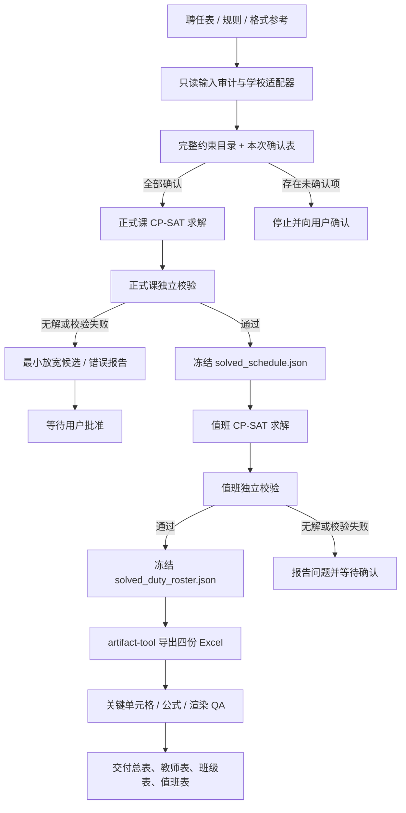

# 高中排课 Skill

这是本地 Codex Skill，用于根据教师聘任表、排课规则和格式参考，求解正式课与早读、静校、晚自习，并导出四份 Excel 成品。

> 公开版不包含任何真实学校的教师、班级、聘任表、课表或运行结果。请仅使用已获授权的数据运行本项目。

## 安装与运行环境

- Python 3.12，安装 `pip install -r requirements.txt`。
- 正式课和值班使用 OR-Tools CP-SAT。
- Excel 导出依赖 Codex 的表格运行环境及 `@oai/artifact-tool`；运行排课时由 Codex 的表格工作流提供该依赖，不提交 `node_modules`。
- 克隆后可将本仓库目录放入 `~/.codex/skills/high-school-timetable`，或从该位置建立符号链接。

## 使用方式

在新任务中说：

```text
使用 $high-school-timetable 排高一课表。
先读取我上传的聘任表、规则和格式参考；先输出本次约束确认表，不要直接求解。
```

若沿用某校规则，只需说明本次差异，例如：

```text
沿用学府版规则；周日晚自习不固定班主任；多班教师晚自习采用 1—3 次、优先 2 次；其余不变。
```

Skill 会先展示完整约束目录和本次差异，得到“确认”后才开始求解。

## 技术路线

本 Skill 不依赖人工拖拽排课或 aSc TimeTables，而是采用可复核、可重复运行的 **Python OR-Tools CP-SAT** 约束求解路线。

1. **输入审计**：只读解析教师聘任表、规则文件和格式参考；学校差异由学府、德化等适配器处理，未知表头不猜测。
2. **规则确认**：展示完整约束目录和本次差异，记录为 `本次约束确认表.md` 与 `rule_profile.json`；未确认不得求解。
3. **正式课求解**：以班级、教师、学科、日期、节次为变量，用 CP-SAT 满足周课时、冲突、禁排、连堂、日课量、半天、体育和数学等约束。
4. **独立校验与冻结**：不复用求解器变量，重新核验全部硬约束；通过后将正式课表冻结为 JSON。若无解，仅给出最小放宽候选，等待确认。
5. **值班求解**：只读取已冻结的正式课 JSON，再用 CP-SAT 安排早读、静校和晚自习；不会回写或改动正式课。
6. **值班独立校验**：核对本班任课资格、正式课时段可用性、工作量、连晚、晚间课负荷及特殊班型要求。
7. **Excel 成品导出**：使用 Node.js 与 `@oai/artifact-tool` 输出四份 `.xlsx`，并检查关键单元格、公式错误和渲染效果。

核心技术栈：Python 3.12、OR-Tools CP-SAT、openpyxl（只读输入）、JSON 运行快照、Node.js、`@oai/artifact-tool`、pytest。

## 技术路线图



## 固定输出

1. `总表学科版.xlsx`：总表仅显示学科。
2. `教师个人课表.xlsx`：按学科、教师纵向分块，显示班级和学科。
3. `班级课表.xlsx`：班级纵向分块，仅显示学科。
4. `早读静校晚自习值班表.xlsx`：仅显示日期、班级、值班类型、教师姓名。

详细规则见 `references/constraint-catalog.md`；每次需要回答的问题见 `references/run-intake.md`。

## 完整约束目录

每次运行都展示本目录及本次取值。除明确标为“每次确认”的项目外，默认按下列规则建模；用户可按编号删除、修改或改为每次确认。

### 正式课硬约束

- **F01** 班级同一时段最多一门正式课。
- **F02** 教师同一时段最多教一个班。
- **F03** 班级、学科、教师的周课时精确满足聘任表。
- **F04** 上课日、节次、活动课、班会、自习和班型固定时段每次确认。
- **F05** 学科、教师、党员、行政、教研组长等禁排时段按本次规则执行。
- **F06** 体育、信息技术、音乐、美术不得排第1、2节。
- **F07** 教师同日只在上午或下午上正式课；无解时先报告最少教师—日期例外，待确认后才放宽。
- **F08** 只任教1班者每天最多2节正式课。
- **F09** 任教2班者每天最多3节；3节不得全来自同一班。
- **F10** 任教超过2班者尽量每天不超过3节；周正式课时超过12节者不受F08—F10日课量限制。
- **F11** 周课时少于5：同班同科每天最多1节。
- **F12** 周课时为5：周一至周五每天1节。
- **F13** 周课时为6：每天至少1节，恰有1天两节连堂。
- **F14** 周课时为7：每天至少1节，恰有2天两节连堂。
- **F15** 连堂必须相邻，禁止第4、5节跨午休连堂。
- **F16** 同一班每天体育最多1节；体育周课时按聘任表。
- **F17** 共享教师与资源不撞课。
- **F18** 直升班等特殊班型的周课时和固定时段按本次确认。
- **F19** 具名教师的集中排课、固定连堂、禁排和班级限制按本次确认。
- **F20** 数学教师每天最多3节数学；不得同一天给两个班各上两节数学。

### 正式课软约束

- **S01** 班主任任教学科尽量周一上午。
- **S02** 教师每日课量及每周上午、下午课量尽量均衡。
- **S03** 语文、数学、英语尽量周内均匀。
- **S04** 尽量减少教师空档与等待。
- **S05** 尽量避免同班同科一天超过2节或连续3节同科。

### 值班硬约束

- **D01** 早读、静校、晚自习的日期和时段每次确认；每班每时段恰好1人。
- **D02** 三类值班仅由本班符合资格的任课教师承担；体育、信息技术、音乐、美术不参与。
- **D03** 同一时间一名教师只负责一个班。
- **D04** 同一教师同班同一值班类型每周最多一次。
- **D05** 早读必须当天有第1或第2节正式课；静校必须当天有第3、4、5或第6节正式课。
- **D06** 只带1班者每周早读1次、静校1次、晚自习1次。
- **D07** 任教两个及以上班且晚自习3次者，早读加静校最多3次。
- **D08** 其他多班教师默认精确2早读加2静校；不可行时只提出最少例外，待确认后采用。
- **D09** 每位教师早读和静校各最多2次。
- **D10** 班主任和行政教师晚自习最多2次。
- **D11** 当天第5—8节已有3节正式课者，不排当天晚自习。
- **D12** 周日→周一→周二→周三→周四→周五序列中不得连续3晚值班。
- **D13** 直升班等指定班型晚自习的可任教学科每次确认。
- **D14** 周日晚自习是否固定班主任每次确认。
- **D15** 多班教师晚自习采用2—3次，或1—3次且优先2次，每次确认。
- **D16** 具名教师固定某日值班等安排按本次确认。
- **D17** 值班不计入教师正式课日课量和周课时。
- **D18** 早读、静校、晚自习必须基于冻结的正式课表安排。

### 值班软约束

- **O01** 三类值班及总值班量尽量均衡。
- **O02** 晚自习优先安排当天有正式课的教师。
- **O03** 尽量避免连续两个晚上值班。
- **O04 已删除**：不再优先把第3次晚自习安排给多班任课、非班主任教师。
- **O05** 尽量避免同一教师同日承担多种值班。
- **O06** 满足D05后，早读仍优先贴近第1、2节，静校优先贴近第4、5节。

### 流程保障

- **G01** 正式课与值班分阶段求解，正式课验证通过后冻结。
- **G02** 每条硬约束同时出现在求解器和独立验证器。
- **G03** 无解时报告最小放宽候选，未经确认不得放宽。
- **G04** 输入与格式参考文件只读；需要更新时创建副本。
- **G05** 固定输出总表学科版、教师个人课表、班级课表、早读静校晚自习值班表四个工作簿。

### 每次必确认项

1. 上课日、节次、活动课、班会、自习和班型固定时段。
2. 周日晚自习是否固定由班主任承担。
3. 多班教师晚自习采用2—3次，还是1—3次且优先2次。
4. 特殊班型及其晚自习允许学科。
5. 具名教师、学科、角色的禁排与特殊安排。
6. 共享教师、单双周课程等资源分配方式。
